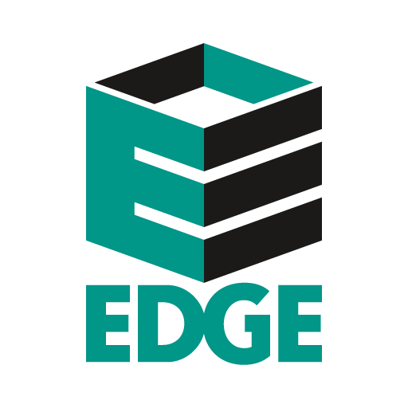
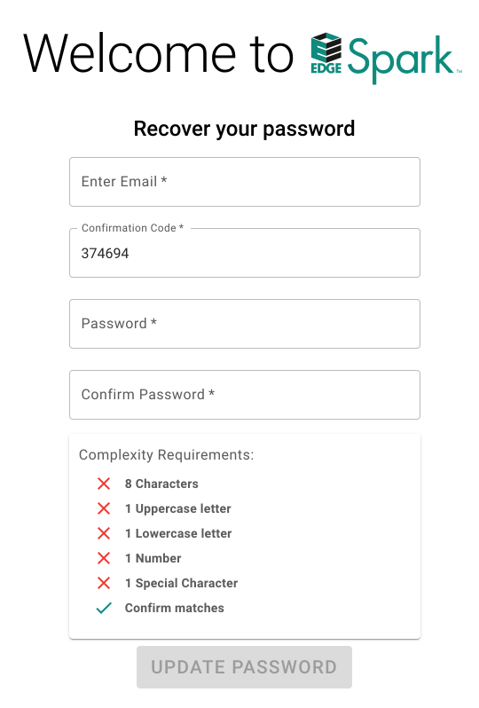

# 'EDGE CASE' - AUCTION EDGE PAIR PROGRAMMING (UI)

Welcome to the Auction Edge Dev Team pair programming repo!

First, we want you to feel as comfortable as possible in this process. ***(Breathe in, breathe out)***

#### COOL STUFF
You will be pairing with one of our dev team members. :sunglasses:

You get to pick the feature! 

You can ask questions.

You can ask questions.

Have you asked questions yet?

Lastly, regardless of which feature you choose to build, **your goal should not be worrying about finishing**. :relieved:

## OVERVIEW

We have provided you a basic [React App](https://reactjs.org/) that has some of the functionality and components already written.

## DIRECTIONS

1. Clone this repo using `git clone https://github.com/rdbishop19/ui-skills-test`
1. `cd` into your local copy
1. Run `npm` commands to install and start the app

#### (SOME BACKGROUND)
*Our app [Spark](https://www.auctionedge.com/spark) utilizes [Material-UI](https://material-ui.com) at its core. We leverage their component API and extensive documentation to help us deliver quality UI code on the daily.*

# FEATURES (PICK ONE)

## #1 - THE LIST :white_check_mark:
  

- **GOAL**:
  The goal for this feature is to build out a replica of the list example shown.

- **GUIDELINES**:

1. Create a component or components to hold each piece of your code.
1. To mock our API data, we have created a JSON list array for you. Map over the `MOCK_LIST` array to display the data.
1. Style the list accordingly utilizing Material-UI components where applicable.

## #2 - THE FORM :white_check_mark:

- **GOAL**:
  The goal for this feature is to build out a change password form. 
  Each form field should be usable. 
  The styling should also match as closely as possible to the image given.

- **GUIDELINES**:

1. Create a component or components to hold each piece of your code.
1. Create your own version of the change password form image we have provided.
1. Style the form accordingly utilizing [Material-UI](https://material-ui.com) components where applicable.
1. Utilize the disable/enable functionality of the Button component given the form requirements being met.

## HELPFUL TIPS
- The `utils` folder is pretty nifty
- You may also create your own Hooks where needed.

## USEFUL LINKS
- https://material-ui.com/
- https://reactjs.org/

## FURTHER READING
Learn about the principle philosophies behind the [Material Design](https://material.io/design/introduction) spec.

----
#### FOOTNOTE
  Our only goal is help you experience a "day in the life" on the Auction Edge team.
  In doing that, we hope to also get a glimpse into who you are, how you tackle problems and work with others, and where you are in your development journey.
  So have fun with it, nerd out with us, and if you're possibly reading this *after* the interview, don't spend *too* much time thinking how you could've done it differently. You did just fine. :muscle:
